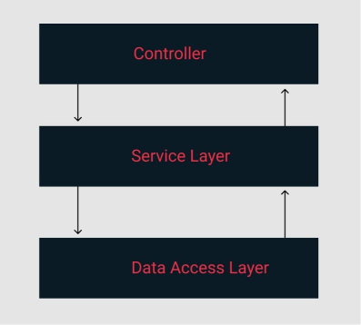

# Node/Express 3 layer architecture

This is a simple implementation on a popular Node.js design approach where each route will use a controller, the controller itself will call a service, which will be the "glue" between the model and the controller. 

### Consider the following example:


What we achieve is that any dependent logic or calls to other services can be implemented in the service and not in the model.

This way we separate concerns and the model is only responsible for the business/domain logic and handling of DB table mapping.

On the other hand the controller is only resposible for handling API calls and reponses from the server (Express in this case) routes.

The service does all the processing for the data.
The service does not call the DB directly.

### The folders can be along the lines of:

Simple, smaller project

```JS
App/Controllers
App/Models
App/Services
App/Routes
...etc
```

Bigger project, split into microservices can be

Orders microservice
```JS
App/Orders/Controllers
App/Orders/Models
App/Orders/Services
App/Orders/Routes
```
Users microservice
```JS
App/Users/Controllers
App/Users/Models
App/Users/Services
App/Users/Routes
```

Monorepo considerations.
Shared e.g. libs, maybe as a package for every microservice
```JS
App/Libs/Utils
App/Libs/Caching
```

# Additional things to consider here

Some other main topics like testing, logging, monitoring, code style and others should be under heavy consideration when dealing with projects of such magnitude in order to keep code clean, leverage scalability, make sure that implementation of new features can be fairly obvious and predictable. This way we keep some organization and we keep our sanity as developers. Here are the topics:

### Testing
For testing a suggested way is having unit tests for controllers and microservices
 
If microservice architecture is existing we should also have contract tests (test communication) and a few integration tests as well.

### Logging & Monitoring:
- morgan
- sentry, app signal, datadoc

### Linter
- eslint
- sonarqube (static code analysis)
- use styleguide

### Off to the implementation

1. ...
2. ...
3. ...

### Further reading and inspiration:

